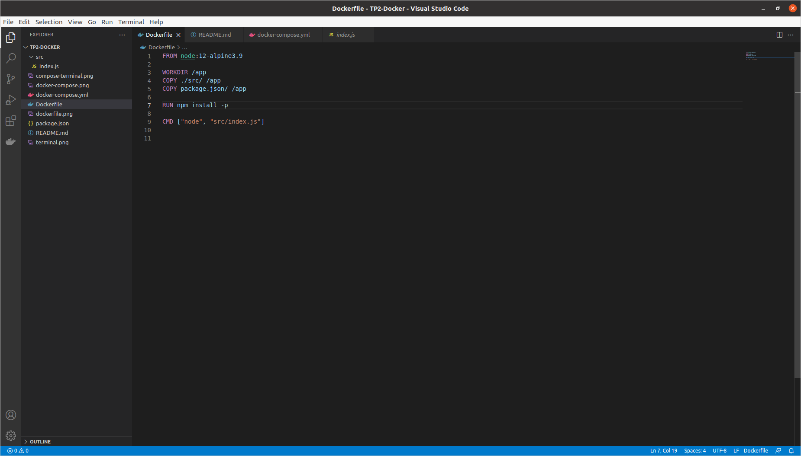

# TP2-DockerFile - Théo Arnal / Rémi Falcati

## Question 2



```bash
COPY ./src/ /app
COPY package.json /app
```
Permet de copier le dossier src et le fichier package.json dans un dossier 'app' qui creer a la racine de l'image

```
RUN npm install -p
```
Installe que les dependance nécessaire au projet 

## Question 3

```
docker build -t my_super_app .
```


 - "-t" permet de mettre un alias à l'image que nous sommes en train de créer

## Question 4 

```
docker-compose up -d (Utiliser sudo si les permissions sont refusées)
```

